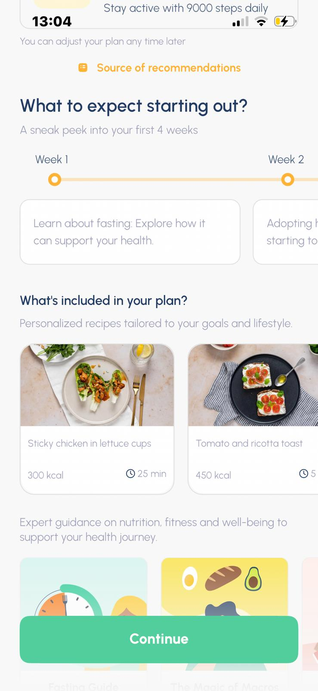
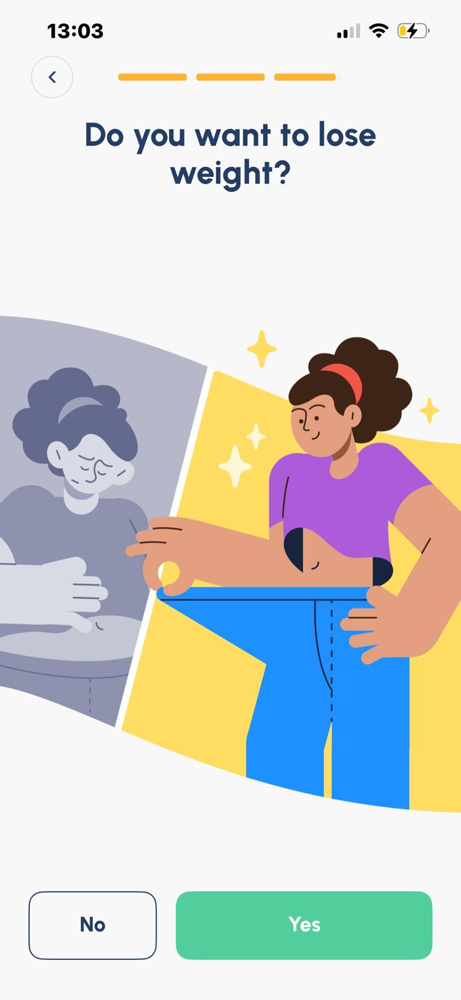

# Bug Reports: Fastic

### BUG-001: Onboarding answers are ignored; the same "personalized" plan is shown to every user

- **Severity:** High
- **Priority:** High
- **Reproducibility:** Always (2/2)
- **Environment:** iPhone 13, iOS 26.5.2, Fastic 1.266.0
- **Description:** The app collects detailed onboarding answers and presents a plan labeled "Personalized recipes tailored to your goals and lifestyle." However, the plan and its sample recipes are identical regardless of the diet selected, so the personalization claim is not fulfilled before the paywall.
- **Steps to Reproduce:**
    1. Install and launch the app.
    2. Start onboarding and select "Vegan" on the Eating Style step.
    3. Complete the remaining onboarding steps until the plan preview screen is displayed.
    4. Note the sample recipes displayed (e.g. "Sticky chicken in lettuce cups")
    5. Uninstall and reinstall the app.
    6. Launch the app again and start onboarding.
    7. Select "Alkaline" on the Eating Style step.
    8. Complete the remaining onboarding steps until the plan preview screen is displayed
    9. Compare the sample recipes with those noted in step 4.
- **Expected result:** The plan and recipes reflect the selected diet (for example, no meat shown for a vegan user), matching the "personalized" claim.
- **Actual result:** The plan and recipes are identical for both diets. A vegan user is shown "Sticky chicken in lettuce cups"; the content does not change with the diet selection.
- **Evidence:** 

- **Root cause hypothesis:** The onboarding answes appear not to be passed to the plan and recipe generation shown before the paywall; the preview likely renders a fixed set of recipes rather than filtering by the user's stated diet. (Behavior after purchase was not tested and is out of scope.)

### BUG-002: Previously answered onboarding questions are asked again in meal planning

- **Severity:** Low
- **Priority:** Medium
- **Reproducibility:** Always (2/2)
- **Environment:** iPhone 13, iOS 26.5.2, Fastic 1.266.0
- **Description:** Questions already answered during onboarding (such as dietary restrictions and eating style) are shown again when the user opens meal planning from the main screen. The previous answers appear pre-selected, but the user is still required to confirm them, repeating work already done.
- **Steps to Reproduce:**
    1. Install and launch the app
    2. Start onboarding and answer the dietary restriction and eating style questions
    3. Complete the remaining onboarding steps untill the main screen is displayed
    4. On the main screen, open the meal planning feature
    5. Go through the meal planning feature
- **Expected result:** Questions already answered during onboarding are not asked again; the previous answers are applied automatically
- **Actual result:** The same questions are shown again with the previous answers pre-selected, and the user must confirm them a second time
- **Evidence:** Screen recording: [bug-002-repeated-questions.mp4](screenshots/bug-002-repeated-questions.mp4)
- **Root cause hypothesis:** Onboarding answers appear to be stored but not read by the meal planning module, so the same questions are re-rendered instead of being skipped. The pre-selected state suggests the data exists but is not used to bypass the step

### BUG-003: Weight-loss questions are shown even though the goal "Gain weight" was selected

- **Severity:** Low
- **Priority:** Medium
- **Reproducibility:** Always (2/2)
- **Environment:** iPhone 13, iOS 26.5.2, Fastic 1.266.0
- **Description:** The user selects "Gain weight" as their goal early in onboarding, but later onboarding steps present weight-loss questions that contradict this choice, indicationg the selected goal is not honored throughout the flow
- **Steps to Reproduce:**
    1. Install and launch the app
    2. Start onboarding
    3. On the goal step, select "Gain weight"
    4. Continue through the remaining onboarding steps
- **Expected result:** Onboarding content is consistent with the selected goal; a user aiming to gain weight is not shown weight-loss questions
- **Actual result:** Weight-loss questions appear despite the "Gain weight" selection, including "Is there a special occasion you want to lose weight for?", "Have you had the same weight loss experience?", and "Do you want to lose weight?"
- **Evidence:** 

- **Root cause hypothesis:** The selected goal appears not to branch the onboarding flow; the same weight-loss question set is likely shown to all users regardless of goal, so the "Gain weight" choice does not filter later steps