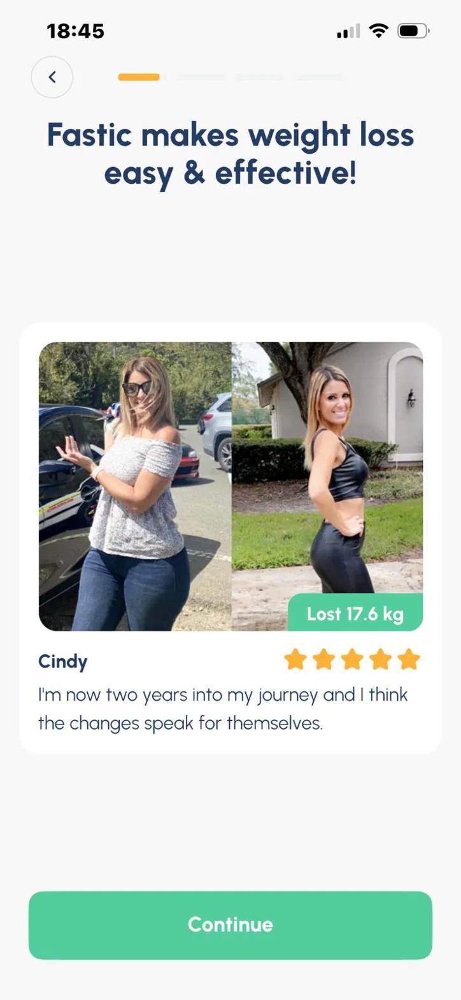
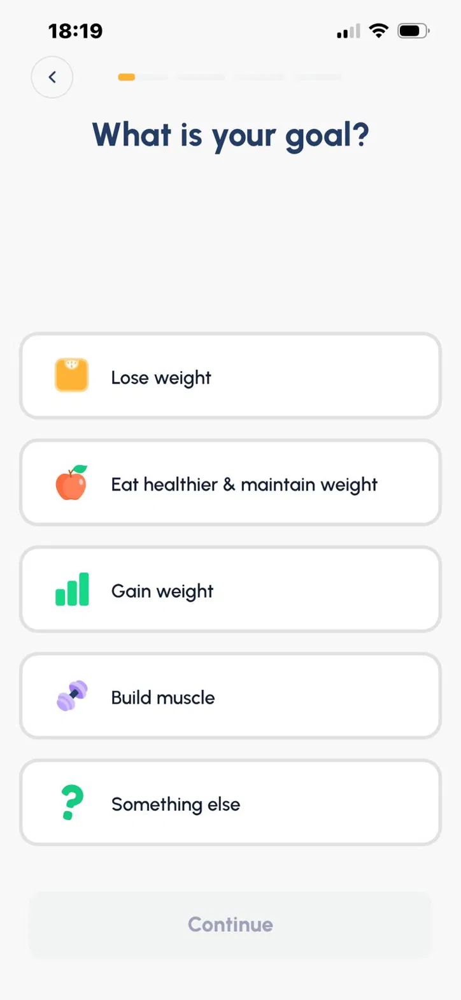
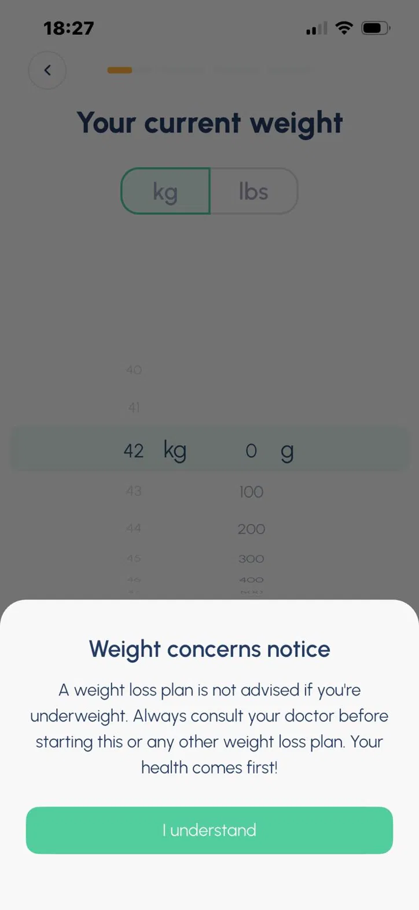
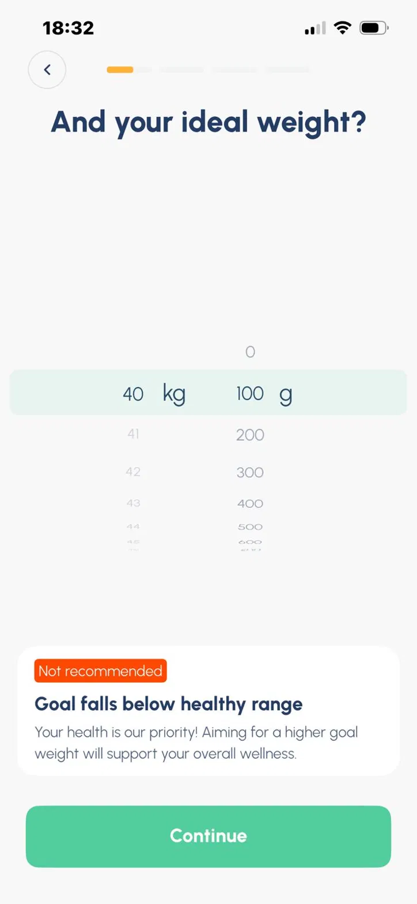
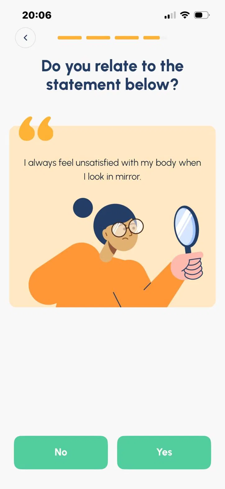
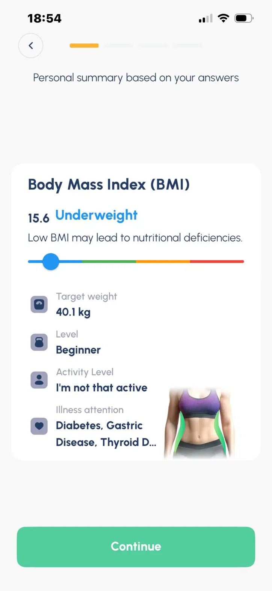

# Product & UX Analysis: Fastic (Intermittent Fasting App)

## Summary

Fastic asks a great deal of the user during onboarding but delivers little real
value before asking for payment. In short, it sells the *promise* of
personalization without *delivering* it. Three findings stand out:

- **No aha moment.** 39 onboarding questions and promotional banners lead straight
  to a trial-free paywall, with no genuine, personal value shown first.
- **Collected but unused input.** The app gathers detailed data (goal, diet, health)
  yet does not act on it, and even re-asks questions it has already answered.
- **A health-safety gap.** Health warnings exist, but plans are not adapted or gated
  for contraindicated users, creating real liability exposure.

The single highest-leverage fix is to use the data the app already collects to show
real, personal value *before* the paywall, which would serve both the user and the
business at once. The full analysis follows.

## Overview

I evaluate products from a quality perspective, but quality is not only "does it
break?" It is also "does it deliver real value to the user and the business?"
This analysis looks at Fastic through that wider lens: not just where the app
fails technically, but where it succeeds or fails as a *product*.

**Method.** I went through Fastic's full first-time user experience (FTUE) on
iPhone 13 (iOS), completing the entire onboarding flow of 39 questions up to the
paywall, and testing edge inputs (extreme goal weights, health conditions) along
the way. This analysis is scoped to iOS, where subscription and paywall flows are
typically most developed. Observations are based on actual usage, not assumptions.

## Core Finding

Fastic sells the *promise* of personalization, but does not *deliver*
personalization. It asks the user 39 questions, signaling a deeply tailored
experience, yet the data it collects rarely translates into real, personal value
before the paywall. The user gives a great deal and receives mostly generic
promises in return. Every issue in this analysis traces back to this single gap
between what the app *asks for* and what it *gives back*.

**FTUE at a glance**

```
39   onboarding questions
 0   personalized insights delivered before the paywall
 0   free trial
 1   paywall (reached before any real use of the app)
 2   permission requests (notifications, tracking)
```

The imbalance in these numbers is the analysis in miniature: a large amount asked
of the user, almost nothing of real value given back before payment.

---

## The FTUE Funnel

Fastic's onboarding is long and front-loads the cost on the user while deferring
any real value. The flow breaks down as follows:

**1. Notification permission.** Requested immediately on launch, before the app
has delivered anything. (I declined. With no value shown yet, there was no reason
to accept.)

**2. Onboarding, 39 questions.** The user provides a large amount of personal data
(goal, weight, height, health conditions, eating habits, motivations).
Interspersed between questions are promotional banners rather than value: a "Cindy
lost 17.6kg" before/after, "lose twice as much weight with Fastic," "cut 500
calories effortlessly." At every step the user *gives* (effort, data) and the app
*gives back* a promise, not a personal result.



**3. Drop-off risk.** The question load is heavy enough that, on my first attempt,
I abandoned the flow before completing it, despite being a motivated user
deliberately testing the app. If a motivated tester dropped here, a typical user
acquired through an ad may drop at even higher rates. This is a testable
hypothesis: onboarding funnel analytics (completion rate per question) would show
exactly where users leave.

**4. "Your plan is ready," an empty plan.** After 39 questions, the app presents a
plan summary (fasting schedule, calorie limit) but no real, personalized content:
no sample day, no meals matched to the user's stated diet. The promise of
personalization is not fulfilled.

**5. Paywall, no trial.** The user is asked to pay before using the app at all.
There is no free trial to let them experience value first.

**6. Post-paywall friction.** Attempting to close the paywall triggers a
spinning-wheel "63% off" offer, then a tracking-consent prompt: stacked obstacles
aimed at a user already trying to leave.

**No aha moment.** Across all 39 steps, the user never receives a genuine "this
works for me" moment before being asked to pay. The entire funnel runs on
promises, never on delivered value.

The gap becomes clear when the current flow is placed next to a value-first
alternative:

```
CURRENT FLOW
question -> banner -> question -> banner -> ... -> "plan ready" -> paywall
(user gives data, receives promises, is asked to pay before any real value)

PROPOSED FLOW
questions -> personal insight (real value) -> trial -> subscription
(user gives data, receives value, experiences it, then decides to pay)
```

---

## Goal Selection vs. Actual Experience

The very first onboarding question lets the user choose a goal: gain weight, lose
weight, build muscle, or something else. This signals a personalized experience
from the very first step.



I chose "gain weight." Despite that choice, the entire experience was built around
weight loss. The promotional content showed a "Cindy lost 17.6kg" before/after,
the banners read "lose twice as much weight" and "shed your stubborn fat," and
none of it reflected my stated goal.

The clearest example came at the end. After 39 questions, the app asked: "Do you
want to lose weight?" I answered no, because I had selected weight gain at the very
start. The app had collected my goal on question one and appeared to ignore it
entirely by the end.

This is not just an inconsistency; it is a loss. Users who want to gain weight or
build muscle are made to feel like strangers in an app they just chose. Such a
mismatch may lead these users to abandon the flow or decline to pay. The app lets
the user select a segment, then fails to serve that segment. The likely cost is in
lost retention and conversion, a hypothesis that could be validated by segmenting
funnel and retention data by the goal chosen on question one.

---

## Collected but Discarded: Repeated Questions

After completing all 39 onboarding questions, I opened the meal planning feature
from the main screen. It presented several questions I had already answered during
onboarding: dietary restrictions, preferred eating style, and others.

The revealing detail is that my previous answers were already pre-selected. The app
clearly stored the data. Yet it still put the same questions in front of the user
again, rather than applying what it already knew. This is not a memory failure; it
is a failure to use the data that was deliberately collected.

The cost is twofold. First, friction: the user repeats work they already did.
Second, and more damaging, trust: a user who sees their 39 answers resurface starts
to wonder whether the app actually understands them, or is simply collecting answers
for their own sake. Seeing one's effort wasted is one of the fastest ways to erode
trust.

This is the clearest evidence of the gap: the app performs personalization (a
long, detailed questionnaire) without the infrastructure to act on it.

---

## What the App Gets Right

The analysis so far has focused on gaps, but the app is not weak across the board.
Its health safeguards, in particular, stand out as genuinely well handled.

**Health safeguards.** The app takes user health seriously in a way that matters
for a fasting product. When I entered an underweight value, it showed "weight loss
is not advised, consult your doctor." When I set an unhealthy goal weight of 40kg,
it flagged "not recommended." It also asks directly about existing conditions
through an "any health concerns" step, and when a condition is selected, it advises
consulting a doctor. Because fasting and calorie restriction are genuinely risky for
some groups, these safeguards are a responsible and important design decision.



(Interface and visual design are evaluated separately in the UI section below.)

These strengths sharpen the central criticism rather than soften it. The app is
clearly capable of thoughtful design and solid engineering. It has the
infrastructure to warn users about health risks and the polish to animate every
screen cleanly. The absence of real personalization is therefore not a limitation of
ability, but a choice of priorities. The app could deliver on its personalization
promise; it simply has not.

---

## UI Evaluation

The interface is, in isolation, well executed. The weaknesses are in what the UI
chooses to prioritize, not in its craft.

**Consistency and interaction.** The design is consistent across the flow. The
primary "Continue" button stays in the same position on every screen and is easy
to locate, which lowers the effort of moving through 39 questions. On the paywall,
the "Continue" call to action is prominent and the close ("X") is easy to find,
so the user is never trapped. Screen transitions are smooth, with no lag or stutter
across the entire flow. The app is visually polished and technically well built.

**Color as signal.** The dominant palette is green and orange. Warnings such as
"not recommended" appear on an orange badge, visually distinct from the ordinary
green flow. Reserving a separate color for caution is a small but correct choice:
color carries meaning here, helping the health warnings stand out rather than
blending in.



**Visual hierarchy, where it works against the user.** One observation is
telling. On most screens, the eye is drawn first to the promotional image, not to
the question the user is there to answer. The visual hierarchy foregrounds the
marketing banner over the functional task. This is the visual echo of the central
finding: even the layout prioritizes selling over serving. A question-first
hierarchy, with promotional imagery secondary, would better match what the user
actually came to do.

**Minor issue.** On at least one question with many options, the "Continue" button
sat above the lower options, so it was possible to proceed without seeing the full
list. Anchoring the button below the options, or making the list clearly
scrollable, would prevent users from advancing past choices they never saw.

---

## An Ethical Tension in the Onboarding

Several onboarding questions are framed to lower the user's self-image rather than
to gather information. Users are asked to agree or disagree with statements like "I
always feel unsatisfied with my body when I look in the mirror" and "junk food is my
guilty pleasure, and I always regret it after indulging."

These are not neutral data questions. They are designed to make the user acknowledge
dissatisfaction and guilt, priming an emotional low point right before the paywall.
The logic is straightforward: a user who has just been led to feel bad about
themselves is more likely to pay for a solution.



In the short term, this may raise conversion. But it carries two real costs. First,
retention: people are less likely to return to a product that made them feel worse
about themselves, and a subscription business depends on users staying. Second,
brand risk: Fastic positions itself as a wellness product, yet this tactic works by
reducing wellbeing to drive a sale. The promise of the brand and the mechanics of
the funnel point in opposite directions.

A healthier approach would frame the same questions around motivation and goals
rather than guilt and dissatisfaction, protecting both the user's wellbeing and the
brand's long-term credibility.

---

## Recommendations

Each recommendation below addresses a specific problem identified in this analysis,
and is classified by effort and impact. The quick wins and the longer-term
strategies often target the same underlying gaps at different costs: fix cheaply
first, then solve durably.

### Quick Wins

**1. Show genuine personal insight before the paywall.**
*(Low effort, high impact.)* The app already collects the data and calculates BMI.
Instead of surrounding that data with promotional banners, present it as the user's
own result: a real, personalized takeaway before payment is requested. This directly
addresses the missing aha moment. Effort is low because the material already exists
in the app; impact is high because a user who sees genuine personal value builds
trust before the paywall, which supports conversion.

**2. Resolve the goal experience inconsistency.**
*(Low effort, medium impact.)* If the user selects "gain weight," the flow should not
show weight-loss banners. Branching the promotional content by the user's stated goal
removes the contradiction between what the app asks and what it shows.

**3. Move notification permission and "how did you hear" to the end.**
*(Low effort, medium impact.)* Both are asked early, before the app has earned the
user's engagement. Moving them to the end of onboarding reduces friction at the most
fragile point of the funnel.

### Mid to Long-Term Strategy

**1. Add a free trial.**
*(High effort, high impact.)* A trial lets the user experience the aha moment before
paying, which is the durable solution to asking for money before showing value. This
is the permanent counterpart to Quick Win 1: where the quick win shows value cheaply,
the trial lets the user live it. Effort is high because it requires trial
infrastructure.

**2. Build data persistence infrastructure.**
*(High effort, high impact.)* Collected answers should be applied throughout the app
rather than requested again. This permanently solves the data waste problem and is
the foundation that makes real personalization possible.

---

## Product Edge Cases

These are not technical failure cases (does the app crash?) but product risks:
situations where the app functions correctly yet still exposes the user or the
business to harm.

**1. Extreme weight asymmetry.**
The app protects health in one direction but not the other. When I entered an
underweight value, it warned "weight loss is not advised." When I set a goal weight
of 40kg, it flagged "not recommended." But when I entered 300kg as the current
weight, there was no warning at all, only "you will gain 86%." The health safeguards
praised earlier are therefore one-sided. A user in the obese range can be guided
toward aggressive goals without the caution applied to underweight users. If such a
user is harmed, the company is exposed to liability for having failed to warn, which
is a direct threat to the profitability the product depends on.

**2. Gender-conditional health questions.**
When I selected non-binary as gender, the pregnancy question did not appear. There is
sound logic here: pregnancy is not relevant for every user. But the risk is that
health-relevant information becomes tightly coupled to a gender selection. Some users
who could still need that screening (for example, a user who can become pregnant but
did not select "female") may be routed around it. A subtle gap, but a real one for a
health product.

**3. Insufficient handling of contraindicated groups.**
The app does ask about existing conditions through an "any health concerns" step,
which is good. But after a serious condition is selected, it only says "consult your
doctor" and lets the user continue to the same plan. The "Personal summary" screen
makes this concrete: it can display a user who is underweight (BMI 15.6), carries a
target weight of 40.1kg, and has flagged Diabetes, Gastric Disease, and Thyroid
issues, all at once, and still proceeds to build a plan. A warning is shown, but the
plan itself is not adapted or gated on any of these signals. For a fasting product,
where the practice is genuinely unsafe for some conditions, a passive warning may not
be enough. The safer approach is to adjust or restrict the plan for contraindicated
groups, not only to advise and proceed. This protects both the user and the
company's liability exposure.



---

## Conclusion

Fastic's central tension is one of timing. Its funnel is optimized aggressively for
*short-term* conversion: 39 questions that build sunk cost, banners that sell before
value is delivered, guilt-based questions right before a trial-free paywall, and
stacked offers for anyone trying to leave. These tactics may lift the immediate
conversion rate, but they work against *long-term* profitability, which depends on
retention, trust, and brand credibility. In effect, the app optimizes from the wrong
end: it trades tomorrow's loyalty for today's conversion.

The opportunity is that these goals need not conflict. The highest-leverage change,
using the data the app already collects to deliver real, personal value before the
paywall, serves both at once: it gives the user a reason to stay and the business a
more durable foundation for recurring revenue. Fastic has already built the hardest
parts, data collection, health awareness, and a polished interface. What it has not
done is turn the promise of personalization into its delivery. Closing that gap is
where both the user experience and the profitability of the product will be won.