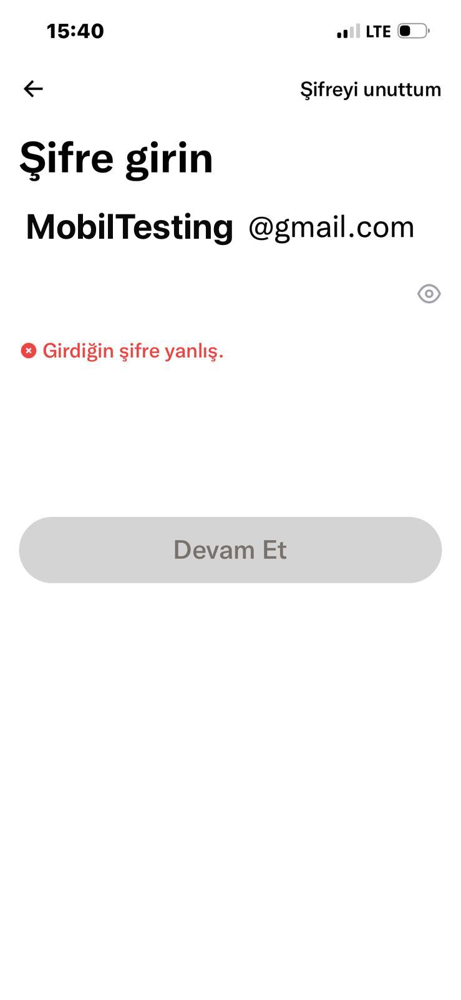
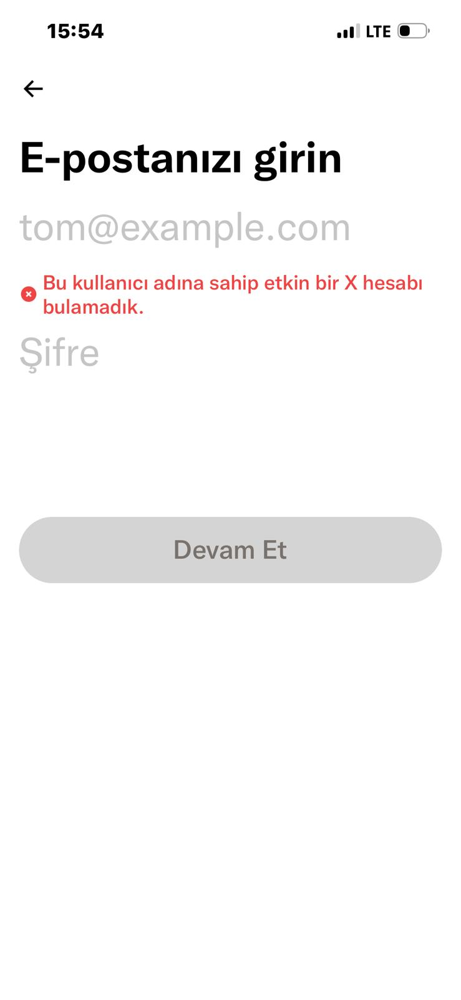
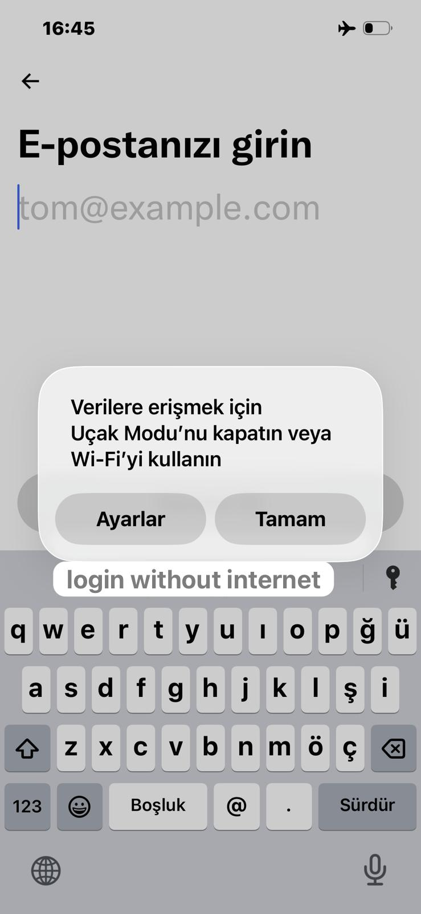

# Mobile Login Testing — X(Twitter) iOS

- Platform: iOS
- Device: iPhone 13
- Test Type: Manual / Functional
- App Version: X (Twitter) - Latest version

## Focus Areas:
- Login functionality
- Error handling
- iOS-specific features (Face ID)
- Network conditions
- Input validation

## Test Summary:
- Total Test Cases: 9
- Pass: 6
- Fail: 3 (TC-3, TC-04, TC-09)

## Key Observations:
- X does not enforce client-side input validation
- Generic error messages returned empty and invalid inputs
- Face ID works only during login key flow
- Network error handling is clear and user-friendly
- No maximum character limit enforced on email field

## Screenshots
### TC-02 — Invalid Password

### TC-03 — Empty Fields

### TC-07 — No Internet

