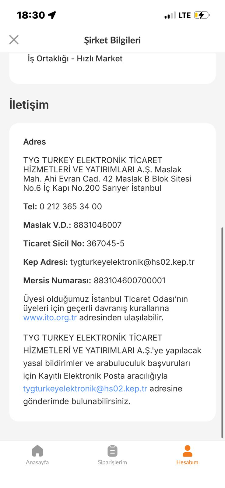
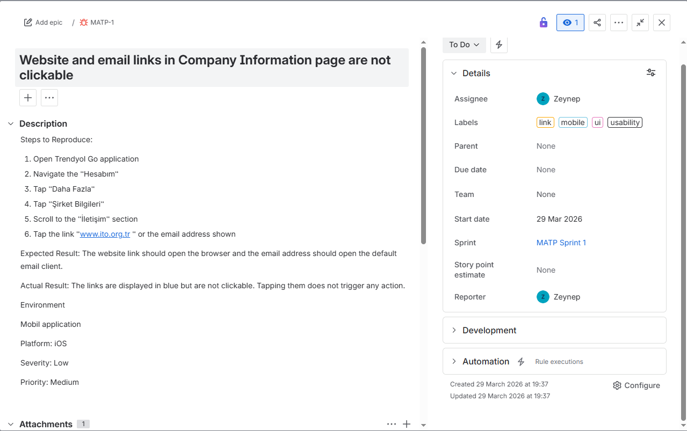

# Bug Report: Website and Email Links in Company Information Page Are Not Clickable

## Bug Details

| Field | Details |
|-------|---------|
| **Bug ID** | MATP-1 |
| **Date** | 29 March 2026 |
| **Tester** | Zeynep Kapacak |
| **Sprint** | MATP Sprint 1 |
| **Status** | To Do |
| **Severity** | Low |
| **Priority** | Medium |
| **Labels** | link, mobile, ui, usability |
| **Platform** | iOS — Mobile Application |

---

## Summary

Website and email links in the Company Information page appear as clickable (blue text) but do not respond to taps.

---

## Steps to Reproduce

1. Open Trendyol Go Application
2. Navigate to "Hesabım"
3. Tap "Daha Fazla"
4. Tap "Şirket Bilgileri"
5. Scroll to the "İletişim" section
6. Tap `www.ito.org.tr` or `tygturkeyelektronik@hs02.kep.tr`

---

## Expected Result

- `www.ito.org.tr` should open in the default browser
- `tygturkeyelektronik@hs02.kep.tr` should open the default email client

---

## Actual Result

Links are displayed in blue but tapping them does not trigger any action.

---

## Environment

| Field | Details |
|-------|---------|
| App | Trendyol Go by Uber Eats |
| Platform | iOS |
| Type | Mobile Application |

---

## Screenshots

