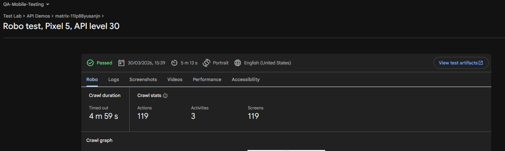

# Day03 — Firebase Test Lab

## What is Firebase Test Lab?
Firebase Test Lab is cloud-based app testing infrastructure. It allows QA engineers to test apps on real physical and virtual devices hosted by Google.

## What is Robo Test?
Robo test automatically crawls the app's UI and simulates user actions without writing any test scripts. It captures screenshots, logs and videos during the test.

## Test Details
- App: ApiDemos (Sample Android App)
- Device: Google Pixel 5
- OS: Android 11 (API Level 30)
- Oriantation: Portrait
- Locale: English (US)
- Test Type: Robo Test
- Result: PASSED

## Crawl Stats
- Total Actions: 119
- Activities Explored: 3
- Screen Visited: 119
- Duration: 4m 49s

## Key Observations
- Robo test successfully crawled the app UI
- No crashed detected during the best
- All 3 activities were explored automatically
- Screenshots captured at each interaction

## QA Note
In a real project, Firebase Test Lab would be used to run tests across multiple devices and OS versions simultaneously. Crashlytics would be capture any crashes and report them in real time.

## Screenshot
