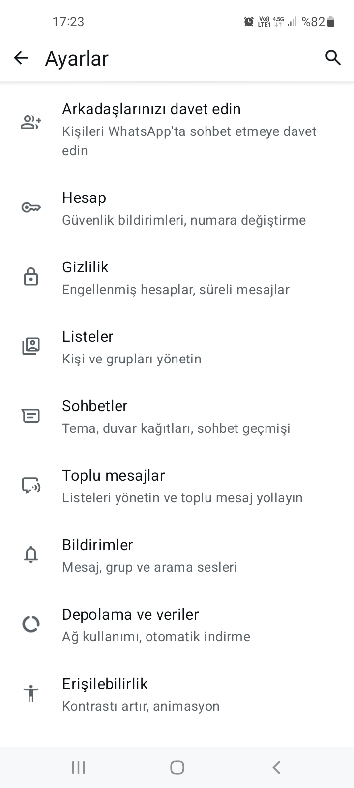
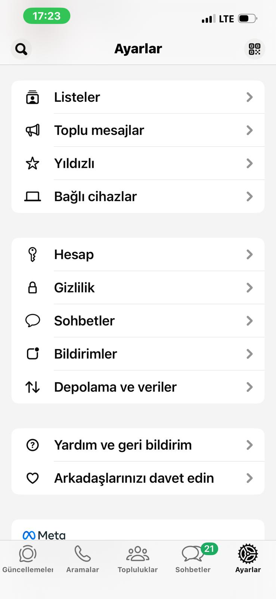

# WhatsApp — Android vs iOS Comparison

## Test Details
- App: WhatsApp
- Android Device: Samsung Galaxy A21s
- iOS Device: iPhone 13
- Android Version: 2.26.11.73
- iOS Version: 26.10.74
- Test Type: Manual /  UI Comparison

---

## Comparison Table

| Feature | Android | iOS |
|---------|---------|-----|
| App Header | "WhatsApp" yazıyor | "Sohbetler" yazıyor |
| Font Weight | Normal | Daha kalın |
| Bottom Navigation | Sohbetler, Güncellemeler, Topluluklar, Aramalar | Güncellemeler, Aramalar, Topluluklar, Sohbetler, Ayarlar |
| Settings Access | Sağ üstte 3 nokta menüsü | Alt menüde Ayarlar butonu |
| Camera in Status | Yok | Durum ekranında kamera ikonu var |
| Status Edit Button | Yok | Kalem ikonu ile direkt düzenleme |
| Back button | Fiziksel alt buton + sol üst | Sadece sol üst swipe |
| Face ID | Yok | Var|
| Broadcast Limit | Ayda 35 mesaj limiti gösteriliyor | Limit gösterilmiyor |
| Notification Style | Android native bildirim | iOS native bildirim |

---

## Key Observations
- iOS versiyonu daha fazla hızlı erişim özelliği sunuyor
- Android 3 nokta menüsü bazı özellikleri gizliyor
- Broadcast limiti sadece Android'de gösteriliyor - bu bir tutarsızlık
- Navigation sırası farklı - kullanıcı alışkanlıkları platforma göre değişiyor
- Face ID sadece iOS'a özel güvenlik katmanı sağlıyor

---

## Screenshots

