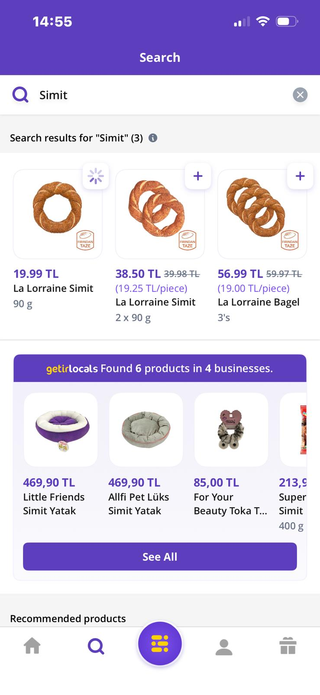
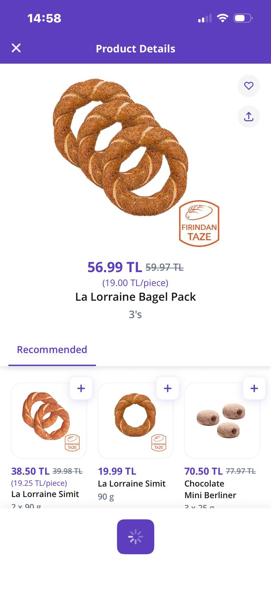

# Bug Report — Getir iOS
 
| Field | Detail |
|---|---|
| **Bug ID** | GETIR-001 |
| **Date** | 2026-05-13 |
| **Reporter** | Zeynep Kapacak |
| **Application** | Getir (getirmarket) |
| **Platform** | iOS — iPhone 13 |
| **OS Version** | iOS 26.4.2 |
| **App Version** | Getir v26.9.0 |
| **Severity** | High |
| **Priority** | P1 |
| **Status** | Open |
| **Type** | Functional — UI State Management |
 
---
 
## Summary
 
When a user attempts to add a product to the basket **before selecting a delivery
address**, the app shows a "Please select an address" alert. After the user taps
**Cancel** on that alert, the triggering button stays **permanently stuck in its
loading state** and becomes unusable. The control does not recover until the user
fully leaves and re-enters the screen.
 
The defect reproduces on **both** the search-results `+` button and the product-detail
**Add to basket** button, indicating a shared state-management issue rather than a
single screen-specific bug. 100% reproducible.
 
---
 
## Environment
 
| Key | Value |
|---|---|
| Device | iPhone 13 |
| OS | iOS 26.4.2 |
| App | Getir v26.9.0 |
| Section | getirmarket |
| Orientation | Portrait |
| Network | Wi-Fi |
| Precondition | No delivery address selected |
 
---
 
## Steps to Reproduce
 
1. Open the Getir app and tap **getirmarket**.
2. Go to the search screen and search for `Simit`.
3. Without selecting a delivery address, tap the **`+`** button on a result.
4. On the **"Please select an address"** alert, tap **Cancel**.
5. Observe the `+` button — it remains stuck in the loading state.
6. Open a product detail page and tap **Add to basket**.
7. Tap **Cancel** on the same alert again — this button also stays in loading.
---
 
## Expected Result
 
After tapping **Cancel**, the `+` and **Add to basket** buttons return to their idle
state, allowing the user to continue (e.g., select an address and retry).
 
## Actual Result
 
The buttons stay permanently in the loading state. They do not recover until the user
navigates away from the screen and returns.
 
---

## Cross-Platform Test Results

| Platform | OS Version | Orientation | Result |
|---|---|---|---|
| iOS (iPhone 13) | iOS 26.4.2 | Portrait | ❌ Reproduced |
| Android (Galaxy A36) | Android 16 | Portrait | ✅ Not reproduced |

> Verified on both platforms. The defect reproduces on iOS but **not** on Android —
> confirming this is an **iOS-side state-reset issue**, not a backend or cross-platform
> defect. The same steps on Android recover correctly (the button returns to its idle state).
 
## Reproducibility
 
- **100%** — every attempt reproduces.
- Confirmed on **two independent controls** (search `+` and product-detail **Add to
  basket**), confirming a systemic pattern rather than an isolated control.
---
 
## Root Cause Hypothesis
 
The button enters a **loading / disabled visual state immediately on tap** (optimistic
UI). The address-validation guard then interrupts the add-to-basket flow and surfaces
the *"Please select an address"* alert. When the user taps **Cancel**, the dismiss
handler exits the flow **without resetting the button's loading-state flag** — the
control's state machine has no transition back to *idle* on the cancel path.
 
Because the **same loading-state pattern backs both** the search-list `+` control and
the product-detail **Add to basket** control, both reproduce identically, pointing to a
**shared component or shared state-management logic** rather than a screen-specific
defect. A likely contributing factor is an **unresolved/rejected promise** in the
add-to-basket handler whose rejection path does not restore the UI state.
 
---
 
## Impact
 
This blocks the **primary entry point of the purchase funnel** (add to basket) for any
user who has not yet selected a delivery address — which includes most first-session and
new users. Although recoverable by leaving the screen, the silent dead-end erodes trust
and directly obstructs the core conversion flow, justifying **High severity / P1**.
 
---
 
## Suggested Fix Area
 
Reset the control to its idle state on **every** exit path of the add-to-basket flow:
 
- Reset the loading-state flag in the address-validation alert's **Cancel/dismiss**
  handler.
- Wrap the add-to-basket handler so a **rejected promise** also restores UI state
  (e.g., a `finally` block that clears the loading flag).
- Since both controls share the pattern, fix it at the **shared component / state layer**
  so a single change covers both surfaces.
> Note: exact implementation is at the discretion of the Getir development team.
 
---
 
## Evidence
 
### iOS — Search results: `+` button stuck in loading state
 

 
*Search results for "Simit". The first product (La Lorraine Simit, 90g) shows its `+`
control rendering a **loading spinner**, while the two sibling products display the
normal `+` icon — captured after the Cancel action described above.*
 
### iOS — Product detail: **Add to basket** button stuck in loading state
 

 
*Product-detail page (La Lorraine Bagel Pack). The bottom **Add to basket** button
renders a **loading spinner** after the Cancel action — the same failure as the search
`+` control, confirming a shared state-management pattern rather than a screen-specific
defect.*
 
> **Android:** verified on Galaxy A21s (Android 12) — the control recovers correctly
> after Cancel, so the defect is confirmed iOS-specific. No screenshot captured; the
> absence of the bug is documented in the Cross-Platform Test Results table above.