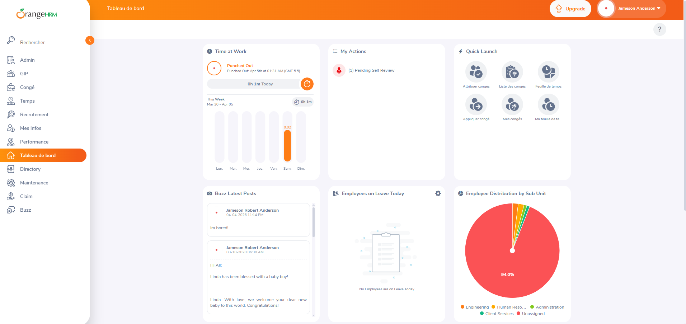

## BUG-01

- **ID:** BUG-01
- **Title:** Dashboard displays mixed French and English text after login
- **Module:** Dashboard / Localization
- **Severity:** Medium
- **Priority:** P3
- **Status:** Open
- **Environment:**
  - Web: [OrangeHRM demo](https://opensource-demo.orangehrmlive.com/)
  - Browser: Chrome
  - OS: Windows 11
- **Preconditions:**
  - Valid admin credentials are available
  - User is on the login page
- **Steps to Reproduce:**
  1. Open the OrangeHRM demo site
  2. Enter valid admin credentials
  3. Log in to the system
  4. Observe the left navigation menu and dashboard content area
- **Expected Result:** All visible UI labels on the dashboard should be displayed in one consistent language.
- **Actual Result:** The left navigation menu is displayed in French, while the dashboard content remains in English.
- **Attachment:** 