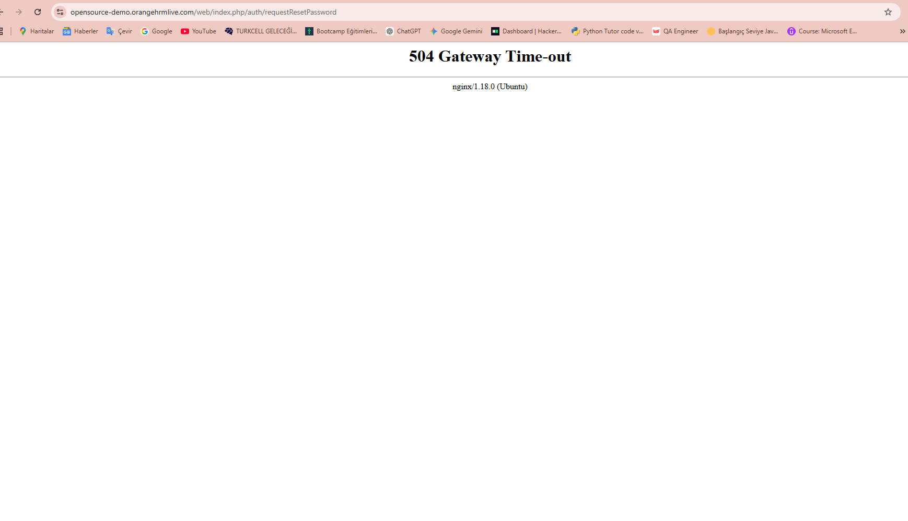

## BUG-02
- **Title:** Forgot password 504 error
- **Module:** Login
- **Severity:** High
- **Priority:** P2 
- **Status:** Open
- **Environment:**
    - Web: https://opensource-demo.orangehrmlive.com
    - Browser: Chrome
    - OS: Windows 11
- **Steps to Reproduce:**
    1. Navigate to https://opensource-demo.orangehrmlive.com
    2. Click "Forgot your password?" link
    3. Enter username: Admin
    4. Click Reset button
- **Expected Result:** Password reset email should be displayed
- **Actual Result:** 504 Gateway Time-out error
- **Screenshot:** 