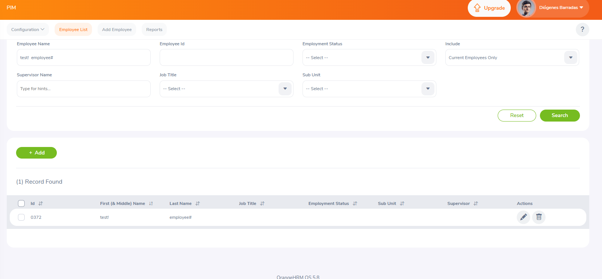

## BUG-03
- **Title:** Special characters accepted in name fields
- **Module:** PIM
- **Severity:** Medium
- **Priority:** P2
- **Status:** Open
- **Environment:**
    - Web: https://opensource-demo.orangehrmlive.com
    - Browser: Chrome
    - OS: Windows 11
- **Steps to Reproduce:**
    1. Navigate to https://opensource-demo.orangehrmlive.com
    2. Log in with Admin / admin123
    3. Click "Add Employee" button
    4. Enter First Name field: test!#$
    5. Click Save button
- **Expected Result:** Warning message displayed — special characters should not be accepted in name fields
- **Actual Result:** Registration successfully completed
- **Screenshot:** 