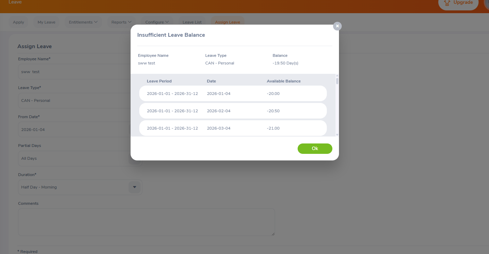

## BUG-04
- **Title:** Negative leave balance
- **Module:** Leave
- **Severity:** High
- **Priority:** P1
- **Status:** Open
- **Environment:**
    - Web:  https://opensource-demo.orangehrmlive.com
    - Browser: Chrome
    - OS: Windows 11
- **Steps to Reproduce:**
    1. Navigate to https://opensource-demo.orangehrmlive.com
    2. Log in with Admin / admin123
    3. Click Assign Leave button
    4. Assign leave to an employee with a balance of 0
    5. "Insufficient Leave Balance" warning appears
    6. Click OK
- **Expected Result:** Leave assignment should be prevented
- **Actual Result:** Assignment is made despite the warning. Balance drops to -21.00
- **Screenshot:** 