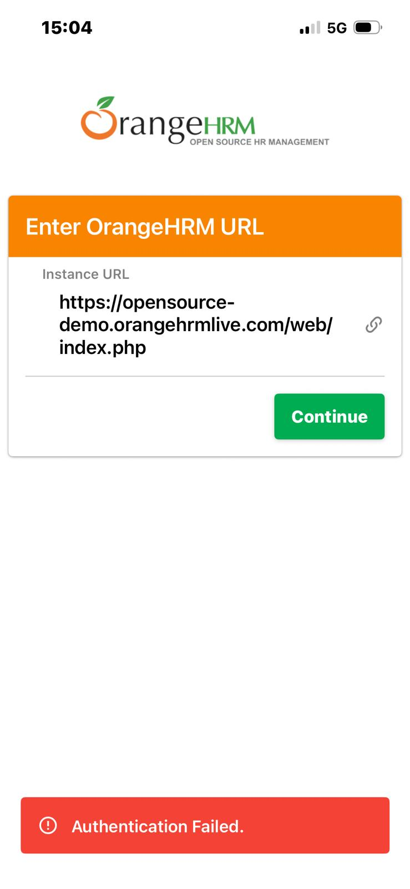

## BUG-08

- **ID:** BUG-08
- **Title:** Inconsistent authentication flow on iOS after entering server URL
- **Module:** Mobile / iOS / Authentication
- **Severity:** High
- **Priority:** P2
- **Status:** Open
- **Environment:**
  - App: OrangeHRM Mobile
  - Device: iPhone 13
  - OS: iOS
- **Preconditions:**
  - App is installed on the device
- **Steps to Reproduce:**
  1. Open the OrangeHRM mobile app on iOS
  2. Enter the URL: [OrangeHRM demo](https://opensource-demo.orangehrmlive.com/)
  3. Tap **Continue**
  4. When the access permission screen appears, tap **Allow**
- **Expected Result:** The login screen should be displayed after the server URL is entered successfully.
- **Actual Result:** Authentication behavior is inconsistent. Sometimes the app shows an **Authentication Failed** error, and sometimes it redirects directly to the home page without displaying the login screen.
- **Attachment:** 