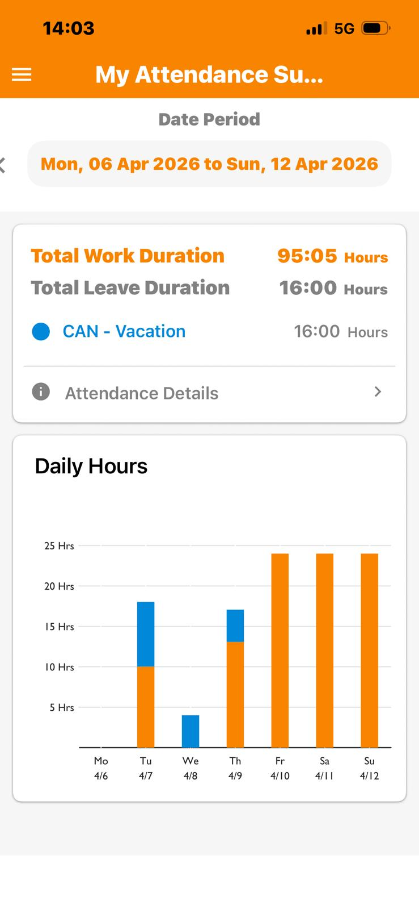

## BUG-09
- **Title:** Attendance arrows cut off
- **Module:** Mobile/iOS
- **Severity:** Low
- **Priority:** P3
- **Status:** Open
- **Environment:**
    - App: OrangeHRM Mobile
    - Device: iPhone 13
    - OS: iOS
- **Steps to Reproduce:**
    1. Open OrangeHRM app on iOS
    2. Enter URL: https://opensource-demo.orangehrmlive.com
    3. Log in with Admin/admin123
    4. Click My Attendance
    5. Observe layout
- **Expected Result:** Navigation arrows < > should be fully visible on the My Attendance page
- **Actual Result:** Navigation arrows are partially cut off and extend beyond the screen boundary. 
    - Same area displays correctly on Android.
- **Screenshot:** 