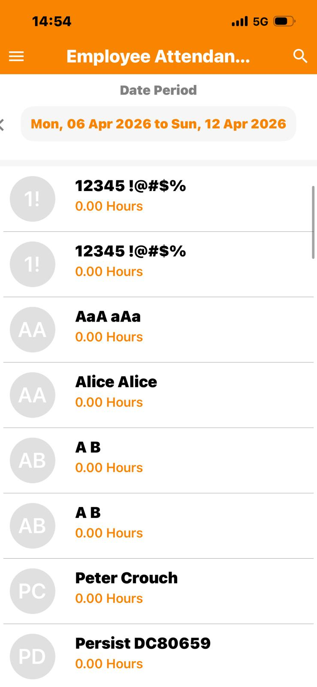

## BUG-10
- **Title:** Text truncation and layout issues on Employee Attendance page
- **Module:** Mobile/iOS
- **Severity:** Low
- **Priority:** P3
- **Status:** Open
- **Environment:**
    - App: OrangeHRM Mobile
    - Device: iPhone 13
    - OS: iOS
- **Steps to Reproduce:**
    1. Open OrangeHRM app on iOS
    2. Enter URL: https://opensource-demo.orangehrmlive.com
    3. Log in with Admin/admin123
    4. Click Employee Attendance
    5. Observe layout
- **Expected Result:** 
    1. Page title "Employee Attendance" fully visible
    2. Navigation arrow < fully visible on screen
- **Actual Result:** 
    1. Page title truncated — displayed as "Employee Attendan..."
    2. Navigation arrow < partially cut off beyond screen boundary
    3. Same area displays correctly on Android
- **Screenshot:** 