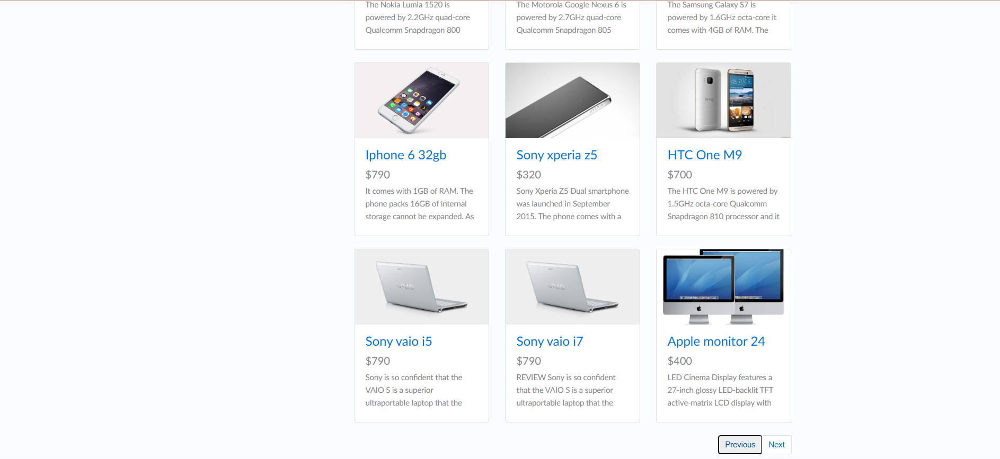

## BUG-01
- **Title:** Previous button changes product order on first page
- **Module:** Product Catalog
- **Severity:** Medium
- **Priority:** P2
- **Status:** Open
- **Environment:**
    - URL: https://www.demoblaze.com
    - Browser: Chrome
    - OS: Windows 11
- **Steps to Reproduce:**
    1. Navigate to https://www.demoblaze.com
    2. Observe the product listing on the first page
    3. Click "Previous" button
    4. Observe the product listing again
- **Expected Result:** Product list should remain unchanged — Previous button should be disabled on first page
- **Actual Result:** Previous button is active on the first page. Clicking it changes the product order and some products disappear from the listing.
- **Screenshot:** 