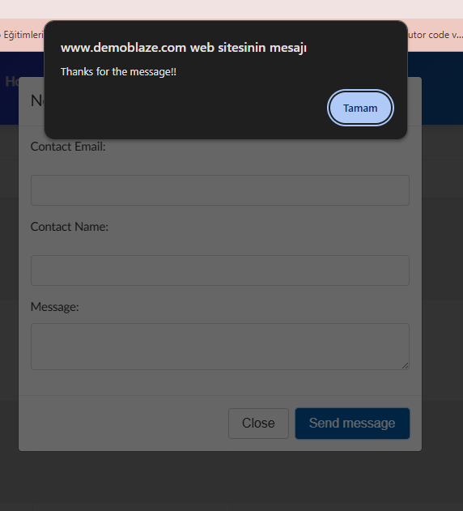

## BUG-07
- **Title:** Empty contact form submission accepted
- **Module:** Contact
- **Severity:** Medium
- **Priority:** P2
- **Status:** Open
- **Environment:**
    - URL: https://www.demoblaze.com
    - Browser: Chrome
    - OS: Windows 11
- **Steps to Reproduce:**
    1. Navigate to https://www.demoblaze.com
    2. Click "Contact" on the navbar
    3. Leave all fields empty
    4. Click "Send message" button
    5. Observe the result
- **Expected Result:** Warning message should be displayed — required fields must be filled
- **Actual Result:** Form is submitted successfully despite all fields being empty. "Thanks for the message!!" notification is displayed.
- **Screenshot:** 
- **Note:** Discovered during exploratory testing — no test case exists for this scenario