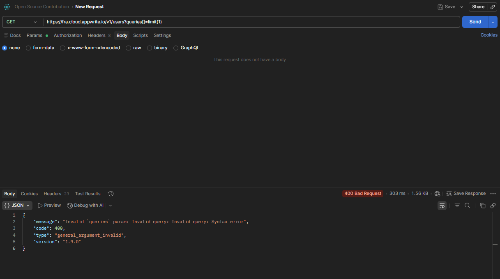
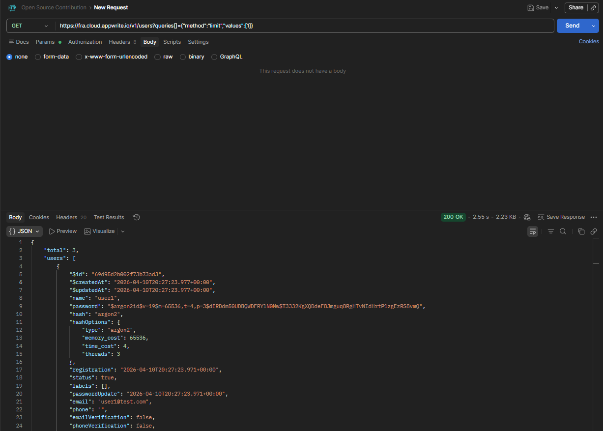

# Open Source Contribution — Appwrite

## Issue
- **Title:** queries[ ] shorthand syntax (e.g. limit(1)) returns 400 Syntax 
Error on Users endpoint
- **Repository:** [Appwrite](https://github.com/appwrite/appwrite)
- **Issue Link:** https://github.com/appwrite/appwrite/issues/11857
- **Status:** Open
- **Date:** April 2026

---

## My Contribution
Discovered and reported a syntax inconsistency in the Appwrite Users API 
query parameter handling on Appwrite Cloud v1.9.0.

**Environment:** Appwrite Cloud — Frankfurt region (fra.cloud.appwrite.io)

---

## Bug Summary

| Syntax | Request | Result |
|---|---|---|
| Shorthand | `queries[]=limit(1)` | ❌ 400 Bad Request |
| JSON format | `queries[]={"method":"limit","values":[1]}` | ✅ 200 OK |
| JSON with offset | `queries[]={"method":"limit","values":[1]}&queries[]={"method":"offset","values":[1]}` | ✅ 200 OK |

---

## Steps to Reproduce
1. Create an Appwrite Cloud project
2. Create an API key with `users.read` scope
3. Send GET request with shorthand syntax:
   `GET /v1/users?queries[]=limit(1)`

## Expected Result
Both syntaxes should work or documentation should clearly state 
which syntax is supported.

## Actual Result
Shorthand syntax returns 400 Bad Request:
`"Invalid query: Syntax error"`

---

## Screenshots

