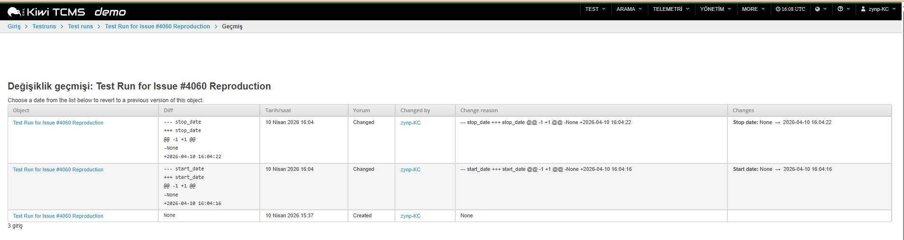

# Open Source Contribution — KiwiTCMS

## Issue
- **Title:** Missing Entries for Test Case Deletion and Addition in Change History for Test Run
- **Repository:** [KiwiTCMS](https://github.com/kiwitcms/Kiwi)
- **Issue Link:** https://github.com/kiwitcms/Kiwi/issues/4060
- **Status:** Open
- **Date:** April 2026

---

## My Contribution
Reproduced the issue on public.tenant.kiwitcms.org and provided detailed steps with expected/actual results.

**Environment:** public.tenant.kiwitcms.org

---

## Steps to Reproduce
1. Create a new Test Run
2. Add a Test Case to Test Run
3. Navigate to History (⚙️ icon → History)
4. Delete the Test Case
5. Check History again

## Expected Result
Addition and deletion of test cases should be logged in Change History for full auidt traceability

## Actual Result
History only shows state changes (start_date, stop_date) and creation entry. No entries for test case addition or deletion.

---

## Screenshot
