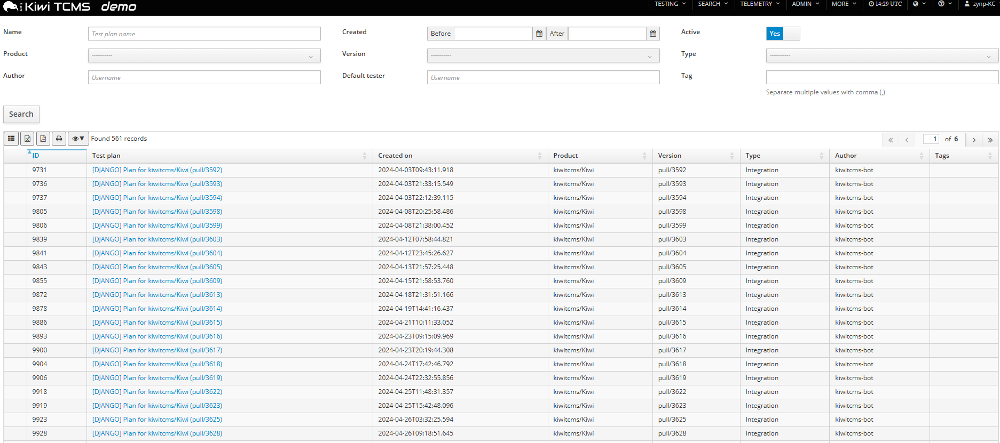

# Open Source Contribution — KiwiTCMS

## Issue
**Title:** Datetime value formatting in data grids are not human-friendly  
**Repository:** [KiwiTCMS](https://github.com/kiwitcms/Kiwi)  
**Issue Link:** https://github.com/kiwitcms/Kiwi/issues/4066  
**Status:** Open  
**Date:** April 2026

---

## My Contribution

Reproduced the reported issue on the public KiwiTCMS test environment and provided detailed steps to reproduce with expected/actual results.

**Environment:** public.tenant.kiwitcms.org

---

## Steps to Reproduce

1. Go to public.tenant.kiwitcms.org
2. Login with GitHub
3. Navigate to Search → Test Plans
4. Observe the "Created on" column

## Expected Result
Date displayed in human-friendly format: `2024-04-03 09:43`

## Actual Result
Date displayed in ISO format: `2024-04-03T09:43:11.918`

---

## Affected Pages
- Test Plans search page
- Test Cases search page
- Test Runs search page
- Bugs search page

---

## Screenshot
