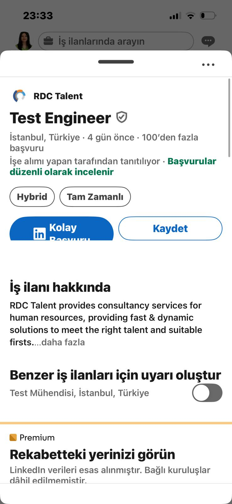
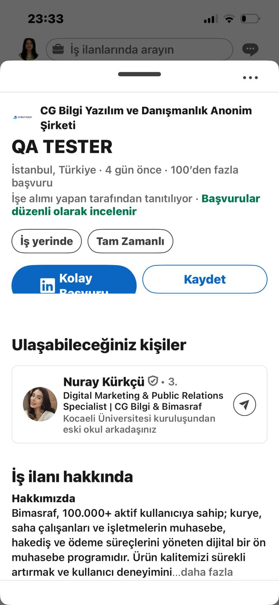

# Bug Report — LinkedIn iOS

| Field | Detail |
|---|---|
| **Bug ID** | LI-MOB-001 |
| **Date** | 2026-05-10 |
| **Reporter** | Zeynep KC |
| **Application** | LinkedIn |
| **Platform** | iOS — iPhone 13 |
| **OS Version** | iOS 26.4.2 |
| **App Version** | LinkedIn 9.1.543 |
| **Severity** | Medium |
| **Priority** | P2 |
| **Status** | New |

---

## Summary

"Easy Apply" (Kolay Başvuru) button label is vertically clipped inside the job detail bottom sheet on iOS in portrait mode. Only the upper half of the "Başvuru" text is visible. Issue affects all job listings with Easy Apply enabled and is 100% reproducible.

---

## Environment

| Key | Value |
|---|---|
| Device | iPhone 13 |
| OS | iOS 26.4.2 |
| App | LinkedIn 9.1.543 |
| Orientation | Portrait |
| Network | Wi-Fi |
| Locale | Turkish |

---

## Steps to Reproduce

1. Open LinkedIn iOS app (Turkish locale, portrait orientation)
2. Tap the **"İş İlanları"** tab (bottom navigation bar)
3. Tap on any job listing from the results
4. Wait for the job detail bottom sheet to slide up
5. Observe the **"Kolay Başvuru"** button in the CTA area

---

## Expected Result

The "Kolay Başvuru" button displays the full label without any clipping or truncation.

---

## Actual Result

The button label is vertically clipped — only "Kolay" and the top half of "Başvuru" text are visible. The bottom half of the text is cut off by the button's boundary.

---

## Cross-Platform Test Results

| Platform | OS Version | Orientation | Result |
|---|---|---|---|
| iOS (iPhone 13) | iOS 26.4.2 | Portrait | ❌ Clipped |
| iOS (iPhone 13) | iOS 26.4.2 | Landscape | ✅ Normal |
| Android | Latest | Portrait | ✅ Normal |

---

## Reproducibility

- **100%** — Affects ALL job listings with Easy Apply across multiple postings.
- Observed consistently over 2+ weeks.

---

## Root Cause Hypothesis

Issue is **LinkedIn-side**, not iOS version related. Evidence:

- Bug predates iOS 26.4.2 update — present for 2+ weeks before today's update
- iOS 26.4.2 did not resolve the issue
- Landscape mode renders correctly → confirms fixed height constraint on portrait layout
- Android unaffected → iOS Auto Layout constraint not adapting to Turkish locale string length

**Likely cause:** Fixed button height constraint in the job detail bottom sheet CTA area does not accommodate the Turkish locale "Kolay Başvuru" string height in portrait mode.

---

## Impact

All Turkish-locale LinkedIn iOS users viewing Easy Apply job listings in portrait mode are affected. While the button remains tappable, the visual clipping creates a degraded user experience and reduces application confidence.

---

## Evidence

### Screenshot 1 — Test Engineer Listing (RDC Talent)

*"Kolay Başvuru" button label vertically clipped in portrait mode*

---

### Screenshot 2 — QA Tester Listing (CG Bilgi Yazılım)

*Same clipping pattern across different job listing — confirms systemic issue*

---

## Suggested Fix Area

The button height constraint in the job detail bottom sheet CTA area should accommodate dynamic content. A fixed height value does not scale with locale-specific string lengths.

Note: Exact implementation approach is at the discretion of the iOS development team.

---

## Disclosure

| Field | Detail |
|---|---|
| **Reported To** | LinkedIn Support |
| **Ticket ID** | #260510-013048 |
| **Report Date** | 2026-05-10 |
| **Status** | In Progress — Awaiting Engineering Review |