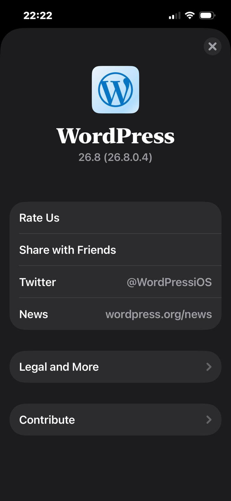
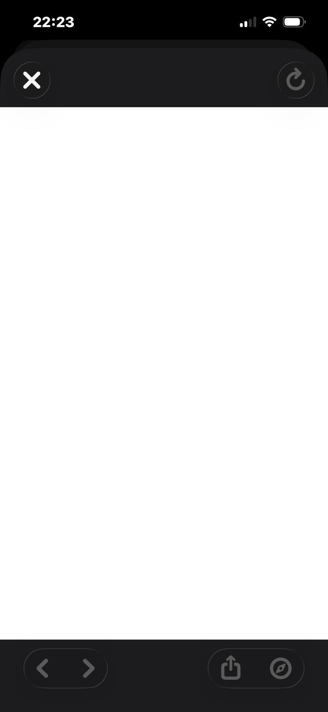

# Open Source Contribution — WordPress iOS

## Issue
- **Title:** About screen: Tapping X (@WordPressiOS) link opens blank webview instead of X app or Safari
- **Repository:** [WordPress iOS](https://github.com/wordpress-mobile/WordPress-iOS)
- **Issue Link:** https://github.com/wordpress-mobile/WordPress-iOS/issues/25493
- **Status:** Open
- **Date:** April 2026

---

## My Contribution
Discovered and reported a deep link bug in the WordPress iOS app through exploratory testing.

- **Device:** iPhone 13
- **iOS:** 16.3.1
- **App version:** 26.8 (26.8.0.4)

---

## Bug Summary
Tapping the X (@WordPressiOS) link on the About screen opens a blank white webview instead of launching the X app or Safari.
The "News" link on the same screen correctly opens in Safari — inconsistent behavior.

---

## Steps to Reproduce
1. Open WordPress iOS app
2. Tap "Me" tab (bottom right)
3. Tap "WordPress about"
4. Tap on X (@WordPressiOS) link

## Expected Result
X app should open (if installed) or Safari should open with the X profile page

## Actual Result
Blank white webview opens inside the app with no content

---

## Screenshots

